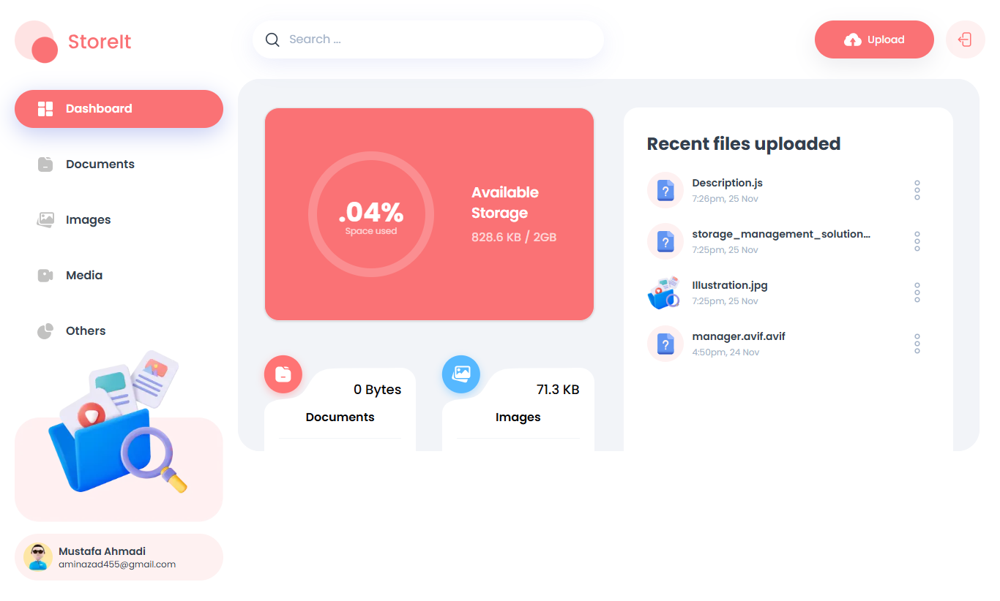

<div align="center">
  <br />
  <h3 align="center">Storage and File Sharing Platform</h3>

   <div align="center">
     A storage management and file sharing platform that lets users effortlessly upload, organize, and share files. Built with the Next.js 15 and the Appwrite Node SDK, utilizing advanced features for seamless file management.
    </div>

  <div>
    
    
    
  </div>

</div>

- [Introduction](#introduction)
- [Tech Stack](#tech-stack)
- [Features](#features)
- [Links](#links)
- [Screenshots](#screenshots)

## Introduction

StoreIt is a clone of Google Drive, built with the following technologies:

- **Next.js:** Handles the user interface and server-side rendering.
- **Appwrite:** Enables storing features.
- **Tailwind CSS:** Provides utility-first CSS classes for rapid styling.

This project offers a collaborative editing experience, allowing multiple users to work on the same document simultaneously and see changes in real-time.

## Tech Stack

- Next.js
- TypeScript
- Appwrite
- ShadCN
- Tailwind CSS

## Features

LiveDocs provides a comprehensive set of features for collaborative editing:

- **Authentication:** Secure signup, login, and logout using Appwrite's authentication system.

- **FIle Uploads:** Effortlessly upload a variety of file types, including documents, images, videos, and audio, ensuring all your important data.

- **View and Manage Files:** Users can browse through their uploaded files stored in Appwrite storage, view on a new tab, rename file or delete.

- **Download Files:** Users can download their uploaded files giving them instant access to essential documents.

- **File Sharing:** Users can easily share their uploaded files with others, enabling collaboration and easy access to important content.

- **Dashboard**: Gain insights at a glance with a dynamic dashboard that showcases total and consumed storage, recent uploads, and a summary of files grouped by type.

- **Global Search**: Users can quickly find files and shared content across the platform with a robust global search feature.

- **Sorting Options**: Organize files efficiently by sorting them by date, name, or size, making file management a breeze.

- **Modern Responsive Design**: A fresh and minimalist UI that emphasizes usability, ensuring a clean aesthetic across all devices.

**Set Up Environment Variables**

The following content is needed in the `.env` file in the root of the project:

```env
NEXT_PUBLIC_APPWRITE_ENDPOINT="https://cloud.appwrite.io/v1"
NEXT_PUBLIC_APPWRITE_PROJECT=""
NEXT_PUBLIC_APPWRITE_DATABASE=""
NEXT_PUBLIC_APPWRITE_USERS_COLLECTION=""
NEXT_PUBLIC_APPWRITE_FILES_COLLECTION=""
NEXT_PUBLIC_APPWRITE_BUCKET=""
NEXT_APPWRITE_KEY=""
```

You can obtain Appwrite credentials by signing up on the [Appwrite website](https://appwrite.io/) website.

## Links

- **Next.js Documentation:** https://nextjs.org/learn - Learn about Next.js features and API.
- **Live demo:** https://storage-management-vert.vercel.app/

## Screenshots

<br>

<div align='center'>



</div>
